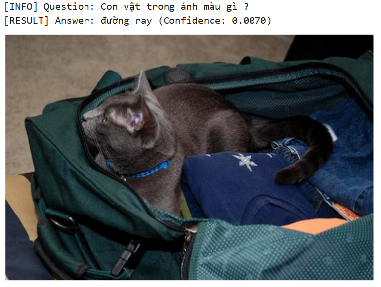

# Installation & Training Guide
## 1. Install.
```bash
pip install salesforce-lavis
pip install torchscale underthesea mlflow efficientnet_pytorch
pip install --upgrade transformers
pip install --upgrade timm
```
## 2. Training.
### 2.1. Train a new model and save checkpoint.
```bash
!bash scripts/train_vqa_model.sh use_selector=<true|false> save_checkpoint_path=<path>
```
### 2.2. Resume training from existing checkpoint.
```bash
!bash scripts/train_vqa_model.sh use_selector=<true|false> load_checkpoint_path=<path>
```
### 2.3. Train from peers (multi-subset training without selector).
```bash
!bash scripts/train_vqa_mulmodels_loop.sh subsets=subset_id1,subset_id2,...
```
## 3. Evaluation.
```bash
from evaluation.evaluate import EvaluatorModeHandler
import pandas as pd

df = pd.read_csv(<path_to_model_answers>)
evaluator = EvaluatorModeHandler(df)
evaluator.evaluate()
```
## 4. Inference.
### 4.1. Load existing model.
```bash
from inference.predictor import PredictorModeHandler

predictor = PredictorModeHandler()
model_path = <path_to_existing_model>
model = predictor.load_final_model(model_path)
```
### 4.2. Get the model output.
```bash
image_path = <your_image_path>
question = <your_question>
predictor.predict_sample(model, image_path, question)
```
The picture below shows an example of a model result:
